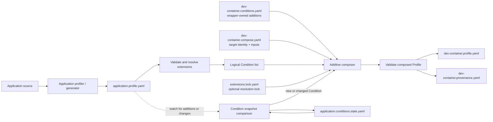

# Exploring composed workload Profiles

Thank you for taking a look at this problem. The goal is to make Runtime
Conditions more useful in an everyday development workflow while giving you
room to discover what a good solution looks like.

This is not a take-home exercise with a hidden preferred implementation. The
repository supplies a realistic application, profiling tools, vocabulary, and
examples so that you can spend your time exploring composition rather than
assembling a test environment.

## The idea to explore

The supplied web application depends on an HTTP content API and Google
Analytics. Its development container needs those application requirements to be
available while the application is built and run, and it additionally needs
GitHub fetch, pull, and push access.

The application and development container are different workloads. They must
have different Profiles, and the application itself must not acquire the
development container's GitHub requirement.

One possible real-world workflow looks like this:



This diagram is a conversation starter, not a prescribed program structure.
The boxes might become separate commands, CI jobs, reusable libraries, files,
events, or something else entirely. Part of the exploration is deciding where
the boundaries should be.

## What is already here

The existing Go profiler can inspect `app/` and generate an application Profile
containing the content API Condition:

```sh
./scripts/generate-application-profile.sh
```

The web application is runnable and testable:

```sh
go test ./...
./scripts/smoke-test.sh
```

The sibling `extensions` repository contains experimental definitions for:

- browser-side Google Analytics event collection; and
- Git source-control access through GitHub.

Both definitions include JSON Schema validation. They are vocabulary you can
use; they do not dictate how your pipeline discovers, stores, or composes
Conditions.

The `examples/` directory contains sketches of manual inputs that could feed
later phases. Feel free to change or replace them. The `reference/` directory
shows one plausible pair of final Profiles so the scenario is concrete; those
files are illustrations, not exact-output fixtures.

## Stable truths from the current specification

Whatever approach you try, these constraints come from the Profile model rather
than from this demo:

- A Profile describes exactly one workload identity.
- The application and development container therefore need separate Profiles.
- The application Profile should contain only application requirements.
- A materialized dev-container Profile should be independently valid and usable
  by an ordinary Profile consumer.
- Extensions define Condition vocabulary and validation; they do not currently
  compose Condition instances.
- Profiles must not contain credentials, secret values, or concrete
  target-environment values such as a GA measurement ID.

Beyond those points, the design space is open.

## Questions worth investigating

You might choose one or several of these questions:

- What should a logical Condition list contain beyond the Condition objects
  themselves?
- Does composition need stable Condition identity, provenance, or semantic
  deduplication?
- Should intermediate artifacts be durable files, in-memory values, or CI
  artifacts passed between jobs?
- Where should extension resolution happen, and should resolved versions be
  locked?
- Is additive concatenation sufficient? What should happen when names collide?
- How can the application Conditions remain attributable to the application
  after appearing in the dev-container Profile?
- What events should cause recomposition: additions only, any semantic change,
  removals, extension changes, or source changes?
- How should a failed later phase preserve the last valid Profile?
- Which pieces seem generally reusable, and which belong only in a demo?

You are welcome to challenge assumptions in the diagram. A short written
argument that improves the model can be as valuable as code.

## A possible way to explore it

If an end-to-end experiment appeals to you, these phases provide a natural
sequence. They are intentionally described as outcomes rather than commands:

1. **Profile the application.** Produce a normal application Profile using the
   existing profiler.
2. **Complete the application view.** Add the manually declared GA requirement
   and validate the resulting application Profile.
3. **Create a logical representation.** Decide how Conditions, extension
   identifiers, identity, and provenance travel between phases.
4. **Compose the development-container view.** Combine the application
   requirements with the wrapper-owned GitHub requirement while assigning the
   dev container its own workload identity.
5. **Validate and export.** Produce a standalone dev-container Profile and make
   failures understandable.
6. **Connect the phases in CI.** Pass real artifacts from profiling through
   composition and validation instead of hiding the workflow behind one
   process.
7. **Optionally react to change.** Explore a watcher or event-driven trigger
   once the explicit pipeline is understandable.

It is perfectly reasonable to implement only enough of one phase to learn
something and then document what the next phase would need.

## Artifacts you may find useful

The opening diagram suggests several artifacts because they make phase
boundaries visible and CI-friendly:

| Possible artifact | Why it might help |
| --- | --- |
| `application.profile.yaml` | Portable output of application profiling |
| a logical Condition-list artifact | Makes normalization and provenance inspectable |
| wrapper-owned Condition input | Keeps development-only requirements separate |
| a composition description | Names the target workload and sources |
| `extensions.lock.yaml` | Makes extension resolution reproducible |
| `dev-container.profile.yaml` | Portable, materialized result for normal consumers |
| `dev-container.provenance.yaml` | Explains where effective Conditions came from |
| `application.conditions.state.yaml` | Supports change detection without comparing formatting |

None of the intermediate filenames or schemas is mandated. If a different set
better demonstrates the idea, explain the tradeoff and use it.

## Using CI as part of the experiment

The supplied workflow currently proves only the foundation in independent
stages: extension validity, application behavior, and application profiling. It
does not pretend composition already exists.

As the experiment develops, consider adding separate jobs or steps for logical
Condition extraction, application completion, dev-container composition,
Profile validation, and provenance inspection. Passing artifacts between those
stages will make the demo resemble a real delivery pipeline and will reveal
which contracts are actually useful.

## What would make the contribution useful?

A useful result should help the next contributor understand more than they did
before. That could be:

- a working multi-phase demonstration;
- one well-designed reusable stage;
- a comparison of two composition approaches;
- evidence that an assumed artifact is unnecessary;
- a clearer failure or provenance model; or
- a proposal for what, if anything, eventually belongs in the specification.

Please document the choices you made, surprises you encountered, and questions
that remain. The purpose is to learn what makes Runtime Conditions applicable
and approachable—not to conform to a preselected implementation.
